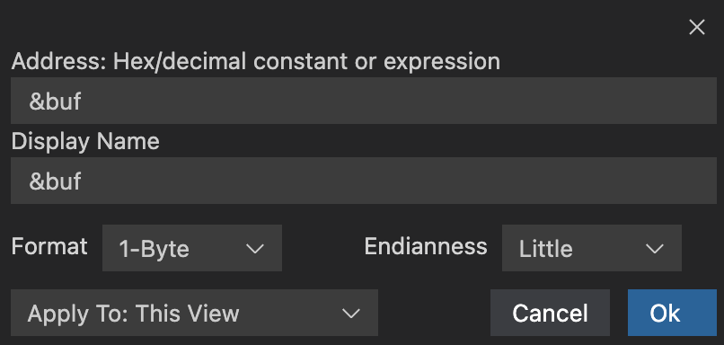

# Change Log

Please note that we are still in Preview mode. For those using the API, this can change in the near future as we refine our proposals but it is getting more mature as it is being used in other extensions.

## [Unreleased]

-   Editing
-   Apply settings to workspace/user/all-views beyond the current view

## 0.0.14 - Oct 11, 2022

-   vscode command `mcu-debug.memory-view.addMemoryView` now supports adding with expression and/or other options
-   Avoid duplicate views wither via URI or via mcu-debug.memory-view.addMemoryView. For something to be considered a duplicate, the expression has to match and if they exist as options, the workspaceFolder and the sessionName have to match. Other optional things are not compared.
-   Fixed Issue#1 STM32 memory locations off by 10 bytes. Actually, it was off by 0x10 bytes, bug introduced when we did the display for 4 and 8 byte grouping.

## 0.0.10 - Oct 7, 2022

-   Initial release, moved from haneefdm/memview to mcu-debug/memview

## 0.0.9 - Sep 3, 2022

-   Initial release of most of the view settings. Applying settings more globally is not yet implemented -- until we finalize a per view set of settings.
-   Introducing 4-byte and 8-byte grouping. However, these groupings, you will not get the Decoded bytes. Instead however, you will see 32-bytes of data per row whereas you see 16-bytes per row in 1-byte mode
-   For 4-byte and 8-byte grouping, we also support little/big endian conversion
-   The top-left of a memory view now shows the start-address of the view. Note that this is different from the base-address which is always a multiple of 16. So, you start-address and base-address can be slightly different and base-address <= start-address. The start-address will always be on the first row though.

